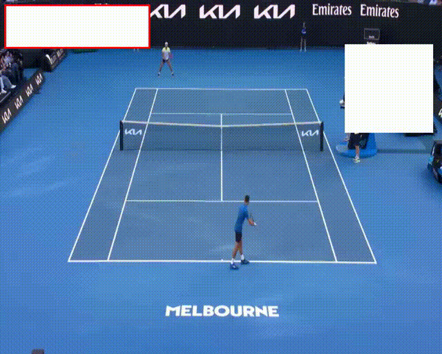

# Track tennis players, determine distance traveled, display mininap

 <h1 align="center">TenisVision</h1>

## Descriptions
* Used YOLOv8 for detecting two players in each frame of a tennis match video.

* Applied integrated ByteTrack tracking to maintain consistent player IDs across frames.

* Calculated the movement distance of each player frame by frame based on bounding box positions.

* Visualized movement history using a minimap showing player positions and paths over time.

* Built the pipeline using Python and OpenCV for frame processing, tracking, and rendering.

 

   
  <i>Demo</i>

